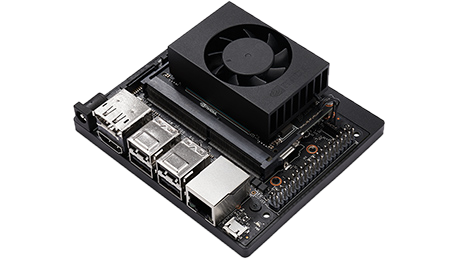
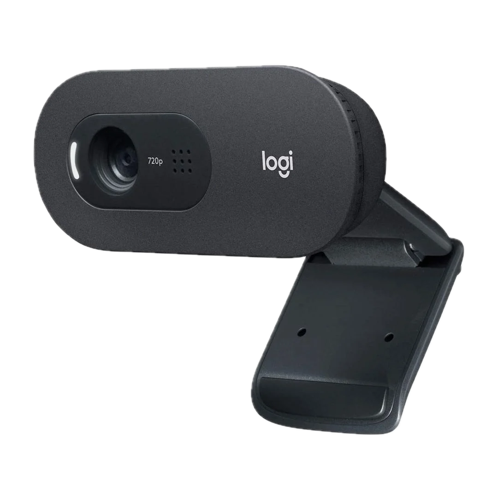
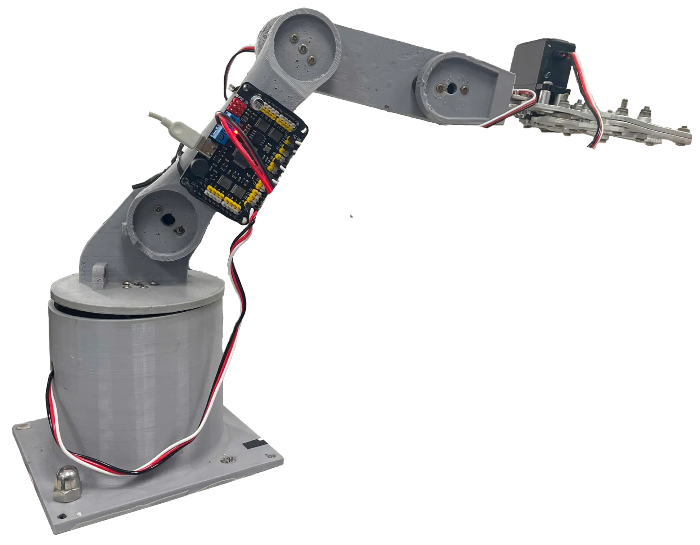
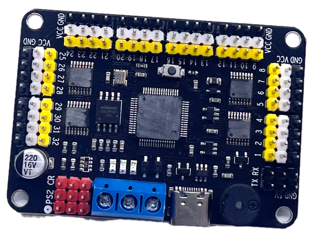
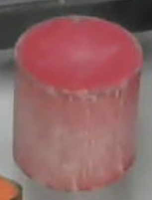
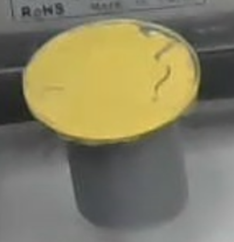
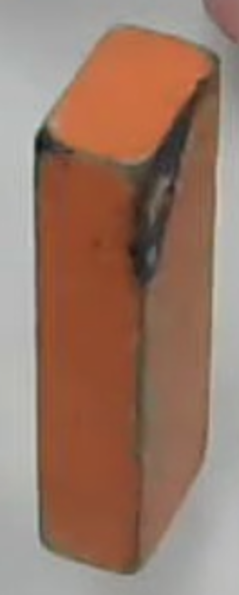
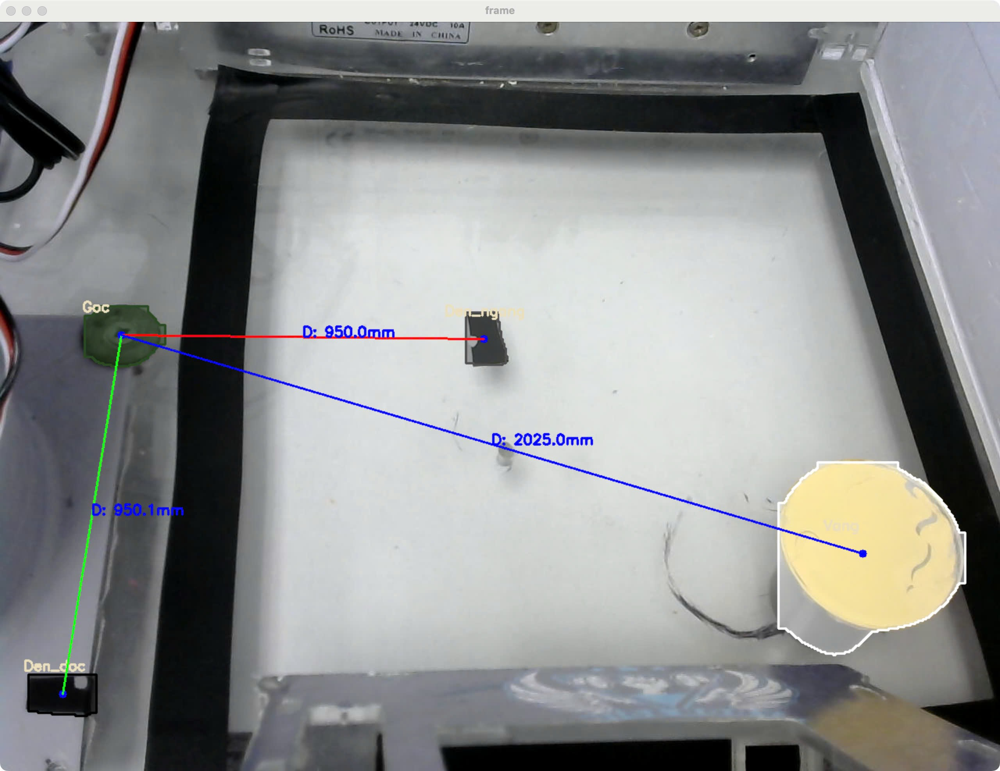

# 🤖 5DOF Robotic Arm Object Sorting System

This project features a **5 Degrees of Freedom (5DOF) robotic arm** designed to automatically **pick up objects** within its workspace and **sort them into three different boxes** based on predefined criteria (e.g. color, size, shape).

## 📌 Project Overview

This project demonstrates a **5 Degrees of Freedom (5DOF) robotic arm** system capable of automatically **picking up objects** within its workspace and **sorting them into three boxes** based on predefined criteria (e.g. color, size, shape).

- **Hardware-Agnostic Design**:  
  The system is designed to run on **any Ubuntu-based embedded device** that supports ROS 2, such as Raspberry Pi, NVIDIA Jetson, or other SBCs. This makes it portable and adaptable to different hardware platforms.  
  In this implementation, we use a **Jetson Xavier NX** as an example of the embedded device.

- **Distributed Vision Processing**:  
  - The embedded device captures live images from a connected camera and publishes them via **ROS 2**.
  - A remote computer subscribes to the image stream and performs **object detection** and **coordinate extraction** using YOLOv8 Segmentation.
  - The computed object coordinates are sent back to the embedded device, which then controls the robotic arm to **pick and place** the object into the appropriate box.

- **Object Sorting**:  
  Based on the detected object class or position, items are sorted into **three designated boxes**.

- **Full Automation**:  
  The system runs autonomously once all ROS 2 nodes are launched.

## 🧰 Technologies Used

### 🤖 Framework & Middleware
- **ROS 2 (Robot Operating System 2)**
  - Handles communication between Jetson and the computer via ROS 2 topics and nodes.
  - Enables modular, distributed processing.

### 🧠 Processing Units
- **Jetson Xavier NX**
  - Captures image from camera
  - Controls the 5DOF robotic arm via UART
  - Subscribes to object position topics
  - Publishes camera image topics  
  

- **Remote Computer (PC or Laptop)**
  - Subscribes to camera feed
  - Runs object detection using YOLOv8 Segmentation
  - Publishes detected object coordinates  

### 📸 Vision System
- **Logitech C505 USB Webcam**
  - Connected to Jetson, streams images into ROS 2  
  

### 🦾 Robotic Arm
- **5DOF Robotic Arm**
  - Handles object picking and sorting
  - Controlled via servo driver module and UART  
  

### ⚙️ Servo Control
- **Servo Driver Module**
  - Communicates with Jetson via UART
  - Executes movement commands for the robotic arm  
  

### 🧠 AI Model
- **YOLOv8 Segmentation**
  - Runs on the remote computer
  - Detects and segments objects
  - Computes their positions relative to the workspace  

### 💻 Programming Language
- **Python**
  - Used to write ROS 2 nodes, detection scripts, and robotic control logic


## 🔸 Objects Used in Sorting Task

In this project, we use **three distinct objects** for detection and sorting. Each object is recognized and classified using the YOLOv8 Segmentation model based on its **visual color and shape characteristics**.

| Object Name | Description           | Appearance                                               |
| ----------- | --------------------- | -------------------------------------------------------- |
| `Do`        | Red-colored object    |  |
| `Vang`      | Yellow-colored object |  |
| `Cam`       | Orange-colored object |  |

- Each object has been **manually labeled** during dataset preparation to ensure detection accuracy.
- The objects are placed randomly in the workspace and the robotic arm identifies, picks, and sorts them into the corresponding box based on their label.


## 🔁 ROS 2 Communication Flow

The system uses **ROS 2** to handle distributed communication between the embedded device (e.g., Jetson Xavier NX) and the remote computer. This section explains the structure of the message flow and topics involved.

### 🧩 Node Architecture

*TODO: update the image*

### 📡 ROS 2 Topics

#### 1. `image`

Jetson send raw image to PC

- Jetson: [cam_pub](./src/cam_pub/)
- PC: [cam_detect](./src/cam_detect/)

#### 2. `control`

PC detected object and send the coordinate to Jetson. Example data:

```json
{
    "name": "Vang",
    "x": 10.02,
    "y": -2.12
}
```

- PC: [cam_detect](./src/cam_detect/)
- Jetson: [arm_control](./src/arm_control/)


## 🎯 Object Positioning in Workspace

To accurately control the robotic arm for object picking, we compute the **coordinates of each object relative to a known origin point** within the camera’s view.

### 📐 Coordinate System Setup

1. **Reference Points Definition**  
   We manually define three reference points in the workspace:
   - **Origin (Gốc)**: This is the fixed (0,0) point of the coordinate system.
   - **X-Axis Point (Den_ngang)**: Used to define the direction and scale of the X-axis.
   - **Y-Axis Point (Den_doc)**: Used to define the direction and scale of the Y-axis.

2. **Real-World Measurements**  
   - The real distance between the origin and the X-axis reference point is **950 mm**.
   - The real distance between the origin and the Y-axis reference point is also **950 mm**.
   - These distances are used to calculate a **pixel-to-millimeter ratio** for coordinate transformation.

### 🧮 Object Coordinate Calculation

1. **Camera captures an image** of the workspace from a top-down view.
2. **YOLOv8 Segmentation** detects the object and identifies its center point in **pixel coordinates**.
3. The script calculates the position of the object relative to the **origin**, using the reference axis points to:
   - Determine orientation (angle correction if necessary)
   - Convert pixel distance into millimeters

### 🖼️ Example (Image Below)

The image below illustrates:
- The **reference points** (`Goc`, `Den_ngang`, `Den_doc`) with lines indicating axis directions.
- A detected object (`Vang`) with a blue dot at its center.
- Distance measurements (in mm) from the origin to each detected point.

