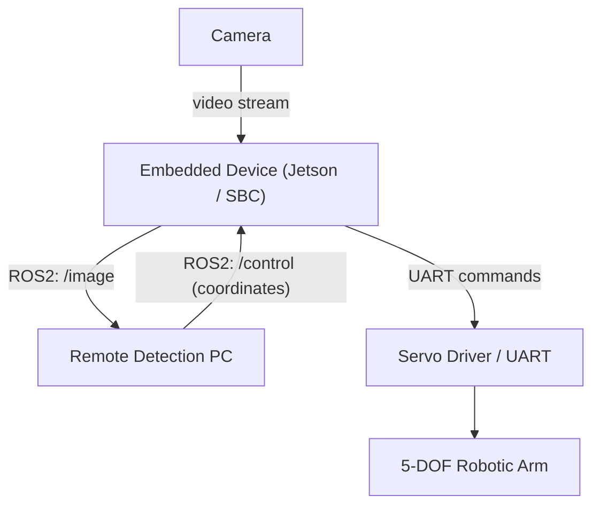
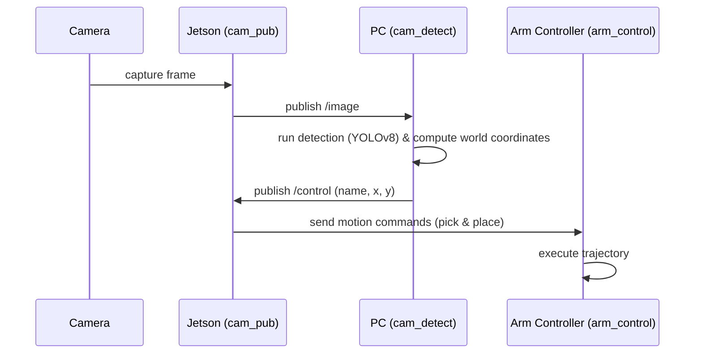
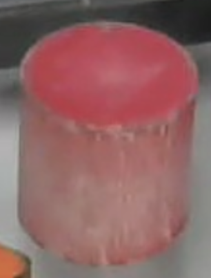
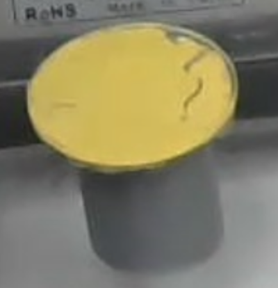
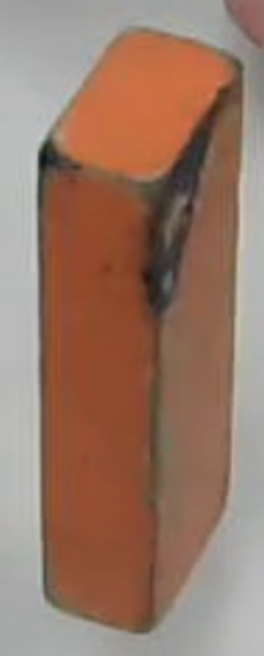
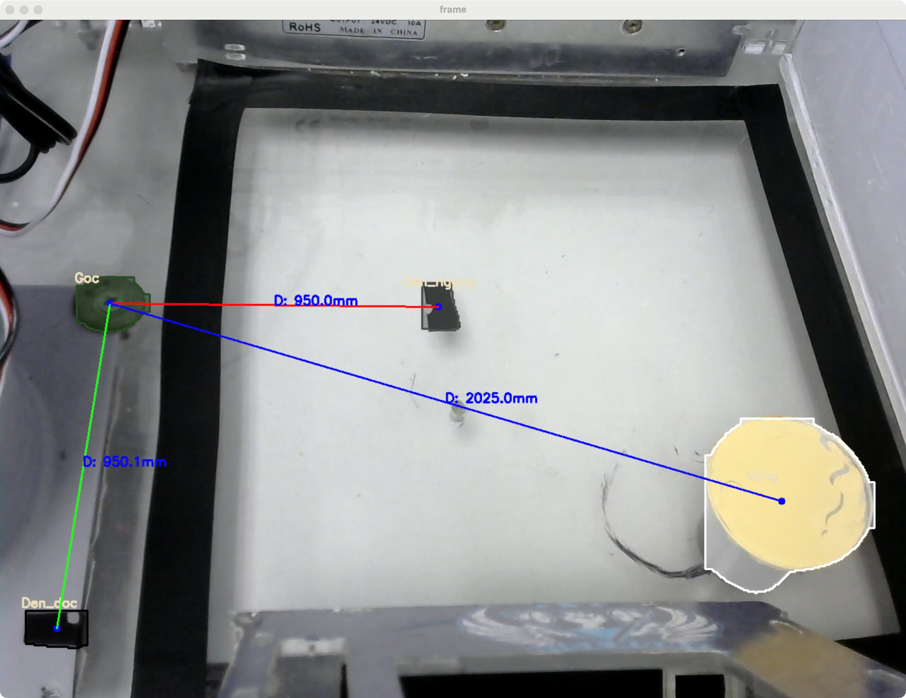

# 5DOF Robotic Arm — Object Sorting

Implementation of a 5-DoF robotic arm system that detects objects with a vision pipeline and sorts them into designated bins. The repository contains ROS 2 Python packages for camera publishing, object detection integration, and arm control alongside a trained detection model.

## Key points
- Purpose: detect, localize, and pick objects, then place them into one of three bins.
- Architecture: distributed pipeline — an embedded device (camera + arm controller) and an external detection node.
- Core components: `cam_pub` (camera publisher), `cam_detect` (detection & coordinate computation), `arm_control` (movement control).

## Mermaid diagrams

### System component diagram

```mermaid
graph TB
  Camera[Camera]
  Jetson["Embedded Device (Jetson / SBC)"]
  PC["Remote Detection PC"]
  Arm["5-DOF Robotic Arm"]
  Servo["Servo Driver / UART"]

  Camera -->|"video stream"| Jetson
  Jetson -->|"ROS2: /image"| PC
  PC -->|"ROS2: /control (coordinates)"| Jetson
  Jetson -->|"UART commands"| Servo --> Arm
```

### Data flow (sequence)

```mermaid
sequenceDiagram
  participant C as Camera
  participant J as Jetson (cam_pub)
  participant P as PC (cam_detect)
  participant A as Arm Controller (arm_control)

  C->>J: capture frame
  J->>P: publish /image
  P->>P: run detection (YOLOv8) & compute world coordinates
  P->>J: publish /control (name, x, y)
  J->>A: send motion commands (pick & place)
  A->>A: execute trajectory
```

## Repository layout (relevant)

- `best.pt` — trained YOLOv8 model used by `cam_detect`.
- `src/arm_control/` — Python package that receives coordinates and drives the arm.
- `src/cam_detect/` — Detection and coordinate conversion node.
- `src/cam_pub/` — Camera publisher node.
- `image/` — documentation images used in this README.

## Overview of components

- `cam_pub` — captures camera frames and publishes them to a ROS 2 image topic.
- `cam_detect` — subscribes to the image topic, runs YOLOv8 segmentation/detection, converts pixel locations to workspace coordinates, and publishes coordinates to a control topic.
- `arm_control` — subscribes to control messages and issues low-level commands to the servo driver (UART) to move the arm.

Assumptions: these packages are implemented as ROS 2 Python nodes or scripts; if you are not using ROS 2, the nodes can be run as standalone Python modules where noted.

## Requirements

- Ubuntu-based system recommended for embedded device and PC (ARM or x86 as appropriate).
- ROS 2 (rolling/foxy/galactic/etc. — use the ROS 2 distribution you have installed).
- Python 3.8+ and standard Python tooling.
- PyTorch + YOLOv8 runtime for detection (the `best.pt` model is included).

Optional hardware: Jetson Xavier NX, Logitech C505 webcam, servo driver module.

## Quick start

1. Install ROS 2 and dependencies for your distribution.
2. On each machine (Jetson and PC), create a Python virtual environment and install required Python packages. If project provides requirements, install them, otherwise install common deps:

```bash
# on both Jetson and PC (example)
python3 -m venv .venv
source .venv/bin/activate
pip install -U pip setuptools
# install torch/yolov8 runtime as required by your environment
pip install -r requirements.txt  # if provided
```

3. Build/install the Python packages (if using ROS 2 -> colcon workspace):

```bash
# from repository root
# (if ROS 2 Python packages are used)
source /opt/ros/<your_ros2_distro>/setup.bash
colcon build --packages-select cam_pub cam_detect arm_control
source install/setup.bash
```

4. Run nodes

On the embedded device (camera + arm controller):

```bash
# Option A: using ros2 run (if packages installed as ROS2 nodes)
ros2 run cam_pub pub
ros2 run arm_control control

# Option B: run modules directly
python3 -m cam_pub.pub
python3 -m arm_control.control
```

On the detection PC:

```bash
python3 -m cam_detect.Detect   # or the equivalent ROS2 node
```

Notes:
- Ensure both machines share a ROS 2 domain (or network) and can reach each other.
- Adjust serial/UART port settings in `src/arm_control` to match your hardware.

## Message/Topic examples

- `/image` — camera image topic (sensor_msgs/Image)
- `/control` — custom control message or JSON payload with fields {name, x, y} (coordinates in mm)

Example control payload (JSON):

```json
{
  "name": "Vang",
  "x": 100.2,
  "y": -45.7
}
```

## Detailed object descriptions

This project trains and detects three object classes used for sorting. The detection node (`cam_detect`) supports both bounding-box and segmentation outputs (YOLOv8). Detection output is then converted into a workspace coordinate for pickup.

- Classes (as used in `best.pt`):

| Object Name | Description           | Appearance                                               |
| ----------- | --------------------- | -------------------------------------------------------- |
| `Do`        | Red-colored object    |  |
| `Vang`      | Yellow-colored object |  |
| `Cam`       | Orange-colored object |  |

Notes on model and inference:
- The provided `best.pt` is a YOLOv8 model trained with a mixture of bounding boxes and segmentation masks. During runtime the node selects the object center as the mean of the mask centroid (when available) or the bounding-box center as fallback.
- Recommended inference parameters:
  - confidence threshold: 0.3–0.5 (tune per environment)
  - NMS IoU threshold: 0.4
  - Minimum detection area: filter out small contours below ~500 px (adjust to camera resolution)
- Labeling: training labels should match the three class names above. For segmentation tasks, prefer polygon masks for more accurate centroid estimation.

Example detection output (internal JSON):

```json
{
  "name": "Vang",
  "class_id": 1,
  "confidence": 0.86,
  "pixel_center": {"u": 823, "v": 412},
  "bbox": {"x": 760, "y": 360, "w": 126, "h": 104}
}
```

## Coordinate system & calibration (detailed)

Accurate pick-and-place requires converting image pixel coordinates (u, v) to real-world coordinates (X, Y) in millimeters relative to a workspace origin. This repository uses a simple, robust calibration based on three reference points. The procedure below assumes the camera is mounted approximately top-down; for strong perspective effects use a homography-based calibration instead (see notes).



1) Reference points
- Define three points in the camera image and measure their known real-world positions:
  - Origin O (pixel: u0, v0) -> world (0, 0)
  - X-axis reference Px (pixel: ux, vx) -> world (dx_real, 0)
  - Y-axis reference Py (pixel: uy, vy) -> world (0, dy_real)

2) Compute pixel vectors and scale
- Pixel vector along X: Vx = (ux - u0, vx - v0)
- Pixel vector along Y: Vy = (uy - u0, vy - v0)
- Pixel distances: |Vx| = sqrt((ux-u0)^2 + (vx-v0)^2), likewise |Vy|.
- Scale factors (mm per pixel):
  - sx = dx_real / |Vx|
  - sy = dy_real / |Vy|

3) Orientation (rotation)
- The orientation angle theta of the workspace X-axis in image coordinates is:

  theta = atan2(vx - v0, ux - u0)

4) Transform pixel -> world
- Translate pixel coordinates to origin: u' = u - u0, v' = v - v0
- Rotate the translated vector by -theta to align with the world axes:

  x_pix =  u' * cos(theta) + v' * sin(theta)
  y_pix = -u' * sin(theta) + v' * cos(theta)

- Convert to millimeters:

  X_mm = x_pix * sx
  Y_mm = y_pix * sy

5) Example
- Suppose dx_real = dy_real = 950 mm, measured pixel distances |Vx| = 1200 px, |Vy| = 1180 px.
- Then sx = 950 / 1200 = 0.7917 mm/px, sy = 950 / 1180 = 0.8051 mm/px.
- For a detected pixel center (u, v) = (823, 412), and origin (u0, v0) = (200, 120), after translation and rotation you obtain X_mm and Y_mm using the formulas above.

Notes & edge cases
- If the camera is not approximately perpendicular to the workspace, or if there is substantial perspective distortion, compute a 3x3 homography (cv2.findHomography) between image points and world points and use cv2.perspectiveTransform to map image points to world coordinates.
- For segmentation masks prefer computing the centroid from the mask (image moments) rather than box centers — it reduces bias for irregular shapes.
- Validate calibration by placing a test marker at known world coordinates and measuring the error; adjust reference points or re-run calibration if error exceeds your tolerance (recommended < 10 mm for reliable grasping).
- Handle missing detections and out-of-bounds coordinates: verify that X_mm/Y_mm fall within the robot's reachable workspace before issuing motion commands.


## Demo

Watch a short demo video here:

[Demo video](https://youtu.be/j9e4Ei9u3aM)

Replace the link above with your hosted demo when available.

## Contributing

Contributions are welcome. Please open issues for bugs or feature requests and follow the repository's coding style. Include tests where appropriate.

## License

This project includes multiple packages. Please refer to the `LICENSE` files in each package directory (`src/arm_control/LICENSE`, `src/cam_detect/LICENSE`, `src/cam_pub/LICENSE`) for details.

